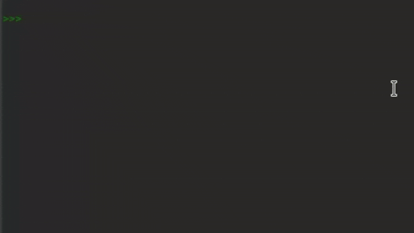

# Printy

 


[](#contributors-)


Printy is a **cross-platform** that lets you colorize and apply some standard formats 
to your text with an intuitive and friendly API based on **flags**. You can
either apply a global format or inline formats to specific parts of your text, and 
some other interesting functionalities!





## Installation

you can either clone this repository or install it via pip
```python
pip install printy
```
## How to use it?

Once you install printy, you can find a short but concise documentation about the
available flags and the syntax opening a python console and running the following 
command:
```python
from printy import helpme
```
This will print out some instructions right away.
 
##### Using global flags

First of all, import printy:
```python
from printy import printy
```

Printy is still a 'print' statement, so you can use it as it is:
```python
printy("text with no format")
```
You can use a global set of flags to specify a format you want to apply to the text,
let's say we want to colorize a text with a bold blue and also adding an underline:
```python
printy("Text with a bold blue color and underlined", 'bBU')
```
##### Using inline format
Although applying a global format is interesting, it is not as much as applying
some specific format to some section of the text only. For that, printy uses a 
intuitive syntax to accomplish that goal. Use the [] to specify the flags to use
for formatting the text, right before the text, and the @ to finish the formatting 
section:
```python
printy("Predefined format [rI]This is red and with italic style@ also predefined format")
```
The text that is not surrounded by the format syntax will remain with the predefined 
format.

But you can always override this predefined format for inline format specifying the flags 
in the 'predefined' parameter
```python
printy("Now this is blue [rI]Still red italic@ and also blue", predefined="b")
```
Or, you can override the whole format without changing the inline format with a global flag:
```python
printy("Now i am still blue, [rI]and also me@, and me as well ", "b")
```

Printy also supports reading from a file, just pass the path to your file
in the file parameter:

```python
# NOTE: Here, it is necessary to specify the flags (if you want) 
# in the 'flags' parameter
printy(file="/path/to/your/file/file.extension", flags="cU")
```

## What about input()?

Printy also includes an alternative function for the builtin input(), that, not only
lets us applies formats to the prompted message (if passed), but also, we can force
the user to enter a certain type of data.
```python
from printy import inputy
```
Let's say we want to get an integer from the user's input, for that, we can set
type='int' in the 'inputy' function (we can specify formats the same way we'd do
 with printy)
```python
a = inputy("How many apples do you want?", "rB", type="int")
b = inputy("How many [rB]apples@ did you get?", type="int")
c = inputy("Are you happy with that?", type="bool")
```
In all of the above examples, if the user enters a value with a type other than 
the one specified in 'type', the message will show again and will prompt also a warning 
(and so on until the user enters a valid value according to the type)

Also, you can specify if, for the integer type for example, the value must
be a positive integer or a negative:

```python
a = inputy("How many apples do you want?", "rB", type="int", options="+")
# ...
```

or for the boolean type:

```python
# ...
c = inputy("Are you happy with that?", type="bool", options="i{y/n}")
```

That will indicate that the affirmative value to be entered would be 'y'
or 'Y' (the 'i' at the beginning indicates 'case insensitive'), and the non
affirmative value would be 'n' or 'N'.

*NOTE: removing the 'i' would force the user to enter 'y' or 'n'. if no
option is passed for the bool type, then the default would be True and False
case insensitive.*

**The best part** is that the returned value's type is also the one of the specified 
type, therefore, from the above examples, both *a* and *b* will be integers, and
*c* will be a boolean, so, you're gonna get the information right as you need it.   

The current supported types are:

* **'int'** for integers, floating point numbers are not accepted, strings that can
be converted to integer are accepted. **Options**: '+', '-'

* **'float'** for floating point numbers, or strings that can be converted to float.
**Options**: '+', '-'

* **'bool'** for booleans, default True and False. 
**Options**: 'case_insensitive {your_defined_true_value / your_defined_false_value}', 
*examples: 'i{y/n}', 'Yes/No'*

* **'str'** the default type, if no 'type' is passed, this will be implemented


## Dependencies

Printy currently support Python 3.5 and up. Printy is a cross-platform library

## Contributing

Please feel free to contact me if you want to be part of the project and contribute.
Fork or clone, push to your fork, make a pull request, let's make this a better app 
every day!!

## Contributors ✨

Thanks goes to these wonderful people ([emoji key](https://allcontributors.org/docs/en/emoji-key)):

<!-- ALL-CONTRIBUTORS-LIST:START - Do not remove or modify this section -->
<!-- prettier-ignore-start -->
<!-- markdownlint-disable -->
<table>
  <tr>
    <td align="center"><a href="https://github.com/mihirs16"><br /><sub><b>Mihir Singh</b></sub></a><br /><a href="https://github.com/edraobdu/printy/commits?author=mihirs16" title="Tests">⚠️</a> <a href="https://github.com/edraobdu/printy/commits?author=mihirs16" title="Code">💻</a></td>
    <td align="center"><a href="https://github.com/farahduk"><br /><sub><b>farahduk</b></sub></a><br /><a href="#ideas-farahduk" title="Ideas, Planning, & Feedback">🤔</a> <a href="https://github.com/edraobdu/printy/commits?author=farahduk" title="Code">💻</a> <a href="#maintenance-farahduk" title="Maintenance">🚧</a></td>
    <td align="center"><a href="https://github.com/edraobdu"><br /><sub><b>Edgardo Obregón</b></sub></a><br /><a href="https://github.com/edraobdu/printy/commits?author=edraobdu" title="Code">💻</a> <a href="https://github.com/edraobdu/printy/commits?author=edraobdu" title="Tests">⚠️</a> <a href="#example-edraobdu" title="Examples">💡</a> <a href="#ideas-edraobdu" title="Ideas, Planning, & Feedback">🤔</a> <a href="#maintenance-edraobdu" title="Maintenance">🚧</a> <a href="https://github.com/edraobdu/printy/commits?author=edraobdu" title="Documentation">📖</a> <a href="https://github.com/edraobdu/printy/issues?q=author%3Aedraobdu" title="Bug reports">🐛</a></td>
    <td align="center"><a href="https://soundcloud.com/lalalaaalala"><br /><sub><b>musicprogram</b></sub></a><br /><a href="#userTesting-musicprogram" title="User Testing">📓</a></td>
  </tr>
</table>

<!-- markdownlint-enable -->
<!-- prettier-ignore-end -->
<!-- ALL-CONTRIBUTORS-LIST:END -->

This project follows the [all-contributors](https://github.com/all-contributors/all-contributors) specification. Contributions of any kind welcome!